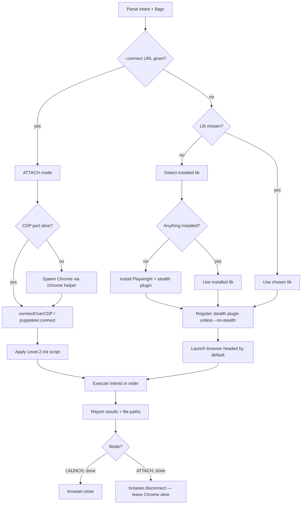

# Browser Automation (Playwright / Puppeteer + Stealth)

You drive a real browser through a real library — Playwright or Puppeteer — with stealth plugins on by default. The library handles launch, lifecycle, and protocol. Your job is to pick the right tool, wire stealth, run the task, and clean up. No raw CDP juggling unless the user explicitly asks for it.

Two run modes — pick per task:

- **LAUNCH mode (default)** — the library launches a fresh Chromium with stealth wired in. Best for scrape/crawl/headless work, full anti-fingerprint coverage.
- **ATTACH mode (`--connect=URL`)** — connect to an existing Chrome already running with `--remote-debugging-port=9222`. Same pattern `/chrome` uses. Best when you want to keep a long-lived browser session (already logged in, has cookies, real-user profile feel) and just drive it from script to script.

Different from `/chrome`: that skill defaults to spawning Chrome via bash helper + attaching. **This skill defaults to library-launched browsers with stealth-by-default**, but the attach path is still first-class for the "reuse running Chrome" workflow.

## Tone Calibration
Match session's coding-level if set. Default: explain each step in plain language; show install commands before running them.

## Operating Laws
**YAGNI, KISS, DRY.** Skill's own: **stealth by default** — every launch ships with stealth plugin enabled unless the user passes `--no-stealth`. The whole point of choosing this skill over `/chrome` is to ship with anti-detect already wired.

## Script Location (MANDATORY)

Every puppeteer/playwright script file (`.cjs`, `.mjs`, `.js`) **MUST** be written into `<projectRoot>/scripts/` — where `<projectRoot>` is the root of the current project (the directory containing `package.json` / `.git`).

### Rules

1. **Resolve `<projectRoot>`** before writing — walk up from CWD until you find `package.json` or `.git`. Fall back to CWD if neither is found.
2. **Create `scripts/` if missing** (`mkdir -p`). Don't ask the user.
3. **Naming:** kebab-case, descriptive. e.g. `scripts/scrape-products.mjs`, `scripts/login-and-screenshot.cjs`, `scripts/capture-api-checkout.mjs`.
4. **Extension:**
   - `.mjs` for ESM (`import ... from`) — default, matches the canonical snippets.
   - `.cjs` when the project is CommonJS (`"type": "commonjs"` in `package.json`, or uses `require()`).
   - `.js` only when `package.json` already declares `"type": "module"` → `.js` files become ESM automatically.
5. **NEVER** write scripts to the repo root, `plans/`, `tmp/`, or any temporary path. Only `<projectRoot>/scripts/`.
6. **Output artifacts** (screenshots, JSON scrape results, auth state) still go to `plans/reports/` as before — don't mix them with script source.

### Run command

```bash
# From project root
node scripts/<name>.mjs
```

If arguments are needed, use `process.argv` — don't hardcode values inside the script so it stays reusable.

## Library Selection

Pick ONE library per session. Don't mix in the same script.

### Selection rule (in order — pick the FIRST that applies)

1. **User passed `--lib=playwright` or `--lib=puppeteer`** → honor it.
2. **Project already has one installed** (check `package.json` deps + `node_modules`) → use that one.
   - Both installed → prefer Playwright (newer, multi-engine, better wait/auto-retry).
3. **Neither installed** → default to Playwright. Auto-install into the project (matching the lockfile: `npm` / `yarn` / `pnpm`).
4. **No Node.js on the machine** → stop and tell the user. This skill needs Node. Suggest installing Node 18+ first, or fall back to `/chrome` (raw CDP path).

### Why Playwright is the default
- Auto-wait built into every action (no explicit `waitForSelector` ceremony for most flows).
- First-class multi-browser (Chromium / Firefox / WebKit).
- Cleaner context isolation (`browser.newContext()` gives fresh cookies/storage).
- Stealth plugin pipeline (`playwright-extra`) maintained alongside puppeteer-extra's.

Puppeteer is fine when the project already uses it, or when a recipe specifically needs Puppeteer's `evaluateOnNewDocument` ergonomics.

## Stealth Plugin (on by default)

Stealth hides the most common automation fingerprints — `navigator.webdriver`, missing `chrome.runtime`, plugin/MIME mismatches, WebGL vendor strings, etc. The `extra` family (`puppeteer-extra-plugin-stealth` works under both `puppeteer-extra` and `playwright-extra`) bundles ~17 evasion modules.

### Install (auto-run when missing)

| Library | Install command |
|---------|-----------------|
| Playwright | `npm install -D playwright-extra puppeteer-extra-plugin-stealth` |
| Puppeteer | `npm install -D puppeteer-extra puppeteer-extra-plugin-stealth` |

Both stacks use the **same** `puppeteer-extra-plugin-stealth` package — that package is library-agnostic. `playwright-extra` adapts it to Playwright's API.

Swap `npm install -D` for `yarn add -D` / `pnpm add -D` based on the project's lockfile. Announce the install in one line ("Installing stealth plugin..."), then proceed — no `AskUserQuestion` needed, it's the documented default.

### `--no-stealth` flag

User passes `--no-stealth` → skip plugin install, fall back to manual Level-2 init scripts (see "Anti-detect layers" below). Use only when the target site explicitly trusts the user-agent or when stealth breaks a recipe.

## <HARD-GATE>
- **Never run on the user's real browser profile.** `userDataDir` (Puppeteer) / `storageState` reuse (Playwright) must point to a skill-managed directory under `~/.cache/claudex-browser/<profile-name>` (Linux/macOS) or `%LOCALAPPDATA%\claudex-browser\<profile-name>` (Windows). Real Chrome/Firefox profile paths are off-limits.
- **Never persist secrets to disk unless asked.** Cookies / auth tokens / form values stay in-memory by default. If the user says "save login", write to `plans/reports/<task>-auth.json`, not the repo root.
- **Prefer `browser.close()` here** (different from `/chrome`). Because this skill *launched* the browser, it owns the lifecycle — `close()` is the clean shutdown. The "didn't shut down cleanly" bubble only matters when attaching to a user-visible Chrome (the `/chrome` case).
- **Never lie about stealth coverage.** Stealth plugin is good for first-tier bot detectors (analytics, basic Cloudflare). It is **not** a guaranteed bypass for Datadome, PerimeterX, or full Akamai Bot Manager. If the user asks "will this bypass X?", answer honestly: test against `https://bot.sannysoft.com` and report what's red.
- **Never `eval` untrusted input.** If the user pastes a script for `page.evaluate`, confirm before running.
</HARD-GATE>

## Intent Parsing

User speaks natural language. Map to one or more intents:

| Intent | Keywords |
|--------|----------|
| **LAUNCH** | "open", "start", "launch browser", "headless", "visible" |
| **NAVIGATE** | "go to", "open page", "visit", URL pasted |
| **INTERACT** | "login", "click", "fill", "type", "sign in" |
| **CAPTURE** | "capture api", "intercept", "sniff network", "har" |
| **SCREENSHOT** | "screenshot", "snap", "full page" |
| **SCRAPE** | "scrape", "crawl", "extract", "collect" |
| **EVALUATE** | "run js", "exec script" — inject JS |
| **STEALTH-CHECK** | "am I detected?", "test fingerprint", "sannysoft" |
| **CLOSE** | "close", "quit", "exit" |
| **ATTACH** | "connect", "attach", "reuse running chrome", URL `http://localhost:9222` |

One request can chain intents — process in order.

## Canonical Snippets

### Playwright + stealth (default)

```javascript
// <projectRoot>/scripts/<task-name>.mjs — generated per task
import { chromium } from 'playwright-extra';
import StealthPlugin from 'puppeteer-extra-plugin-stealth';
import { createCursor, installMouseHelper } from 'ghost-cursor-playwright';

chromium.use(StealthPlugin());

const browser = await chromium.launch({
  headless: false,
  args: [
    '--disable-blink-features=AutomationControlled',
    '--disable-features=AutomationControlled',
  ],
});

const context = await browser.newContext({
  viewport: { width: 1440, height: 900 },
  userAgent: undefined,
  locale: 'en-US',
});

const page = await context.newPage();
await installMouseHelper(page);                // mouse overlay (call BEFORE goto)
const cursor = await createCursor(page);

await page.goto('http://localhost:3000');

await page.focus('input[name="email"]');
await page.keyboard.type('admin@local', { delay: 60 + Math.random() * 80 });

await page.focus('input[name="password"]');
await page.keyboard.type('admin', { delay: 60 + Math.random() * 80 });

await cursor.actions.click({ target: 'button[type="submit"][form="login"]' });

await page.waitForURL('**/dashboard');
await page.screenshot({ path: 'after-login.png' });

await browser.close();
```

### Puppeteer + stealth

```javascript
import puppeteer from 'puppeteer-extra';
import StealthPlugin from 'puppeteer-extra-plugin-stealth';
import { createCursor, installMouseHelper } from 'ghost-cursor';

puppeteer.use(StealthPlugin());

const browser = await puppeteer.launch({
  headless: false,
  defaultViewport: { width: 1440, height: 900 },
  args: [
    '--disable-blink-features=AutomationControlled',
    '--disable-features=AutomationControlled',
  ],
});

const page = await browser.newPage();
await installMouseHelper(page);                // mouse overlay (call BEFORE goto)
const cursor = createCursor(page);

await page.goto('http://localhost:3000');

await page.focus('input[name="email"]');
await page.keyboard.type('admin@local', { delay: 60 + Math.random() * 80 });

await page.focus('input[name="password"]');
await page.keyboard.type('admin', { delay: 60 + Math.random() * 80 });

await cursor.click('button[type="submit"][form="login"]');

await page.waitForNavigation();
await page.screenshot({ path: 'after-login.png' });

await browser.close();
```

### ATTACH mode — connect to existing Chrome on port 9222

When the user asks to "connect to running Chrome", "reuse existing Chrome", "attach", or passes `--connect=http://localhost:9222` → use attach mode. This reuses an already-open Chrome (its cookies, logged-in sessions, real-user profile feel).

**Prerequisites — Chrome must be running with CDP open:**

If user doesn't have Chrome on port 9222 yet, spawn it first via the `/chrome` helper scripts (same scripts, same flags):

```bash
# POSIX
bash claude/skills/chrome/scripts/launch-chrome.sh

# Windows PowerShell
powershell -ExecutionPolicy Bypass -File .agents\skills\chrome\scripts\launch-chrome.ps1
```

These scripts handle OS detection, the persistent throwaway user-data-dir, and the full anti-throttling / anti-prompt flag list. Verify CDP is alive:

```bash
curl -s http://localhost:9222/json/version
```

Non-empty JSON with `"Browser": "Chrome/..."` → ready to attach.

**Playwright attach:**
```javascript
import { chromium } from 'playwright';

const browser = await chromium.connectOverCDP('http://localhost:9222');
const context = browser.contexts()[0] ?? await browser.newContext();
const page = context.pages()[0] ?? await context.newPage();

// ---- Apply Level-2 init script (stealth plugin can't hook attached context) ----
await context.addInitScript(() => {
  Object.defineProperty(navigator, 'webdriver', { get: () => undefined });
  Object.defineProperty(navigator, 'languages', { get: () => ['en-US', 'en'] });
  Object.defineProperty(navigator, 'plugins',   { get: () => [1, 2, 3, 4, 5] });
  window.chrome = window.chrome || { runtime: {} };
});

await page.goto('http://localhost:3000');
// ... do work ...

await browser.disconnect();   // disconnect, NOT close — we didn't launch this Chrome
```

**Puppeteer attach:**
```javascript
import puppeteer from 'puppeteer';

const browser = await puppeteer.connect({ browserURL: 'http://localhost:9222' });
const pages = await browser.pages();
const page = pages[0] ?? await browser.newPage();

await page.evaluateOnNewDocument(() => {
  Object.defineProperty(navigator, 'webdriver', { get: () => undefined });
});

await page.goto('http://localhost:3000');

await browser.disconnect();
```

**Important constraints for attach mode:**
- **Use `browser.disconnect()`**, not `close()`. The Chrome process belongs to the user — closing it triggers the "Chrome didn't shut down cleanly" bubble next launch.
- **Stealth plugins don't fully apply.** `puppeteer-extra-plugin-stealth` patches the launch step; attached contexts only get init-script-level overrides. Sufficient for most cases — escalate to Level 3 if blocked.
- **No fresh context isolation** unless you call `browser.newContext()` (Playwright). Default attaches to the existing context with its cookies/storage.

## Anti-detect Layers

Sites detect automation via launch flags, runtime globals, and rendering fingerprints (Canvas, WebGL, AudioContext, fonts, TLS JA3). Layers in order of need:

### Level 1 — Launch flags (always on)
- `--disable-blink-features=AutomationControlled` → removes `navigator.webdriver = true`
- `--disable-features=AutomationControlled` → belt-and-suspenders
- Headed mode + realistic viewport (`1440x900` or `1920x1080`)
- Don't pass `--enable-automation` (Puppeteer used to add this by default; stealth plugin strips it)

### Level 2 — Stealth plugin (default for this skill)
`puppeteer-extra-plugin-stealth` covers the common evasions automatically. No manual init scripts needed when the plugin is on.

If `--no-stealth` was passed, the manual init script is:

```javascript
await context.addInitScript(() => {
  Object.defineProperty(navigator, 'webdriver', { get: () => undefined });
  Object.defineProperty(navigator, 'languages', { get: () => ['en-US', 'en'] });
  Object.defineProperty(navigator, 'plugins',   { get: () => [1, 2, 3, 4, 5] });
  window.chrome = window.chrome || { runtime: {} };
  const origQuery = window.navigator.permissions.query;
  window.navigator.permissions.query = (p) =>
    p.name === 'notifications'
      ? Promise.resolve({ state: Notification.permission })
      : origQuery(p);
});
```

### Level 3 — When stealth plugin still gets caught
Some CDN walls (full Datadome, PerimeterX Bot Defender, Akamai BMP) fingerprint TLS, mouse-motion entropy, and timing leaks the plugin doesn't cover. Options when Level 2 fails:

- **`rebrowser-patches`** — patches `node_modules/playwright|puppeteer` to plug CDP leaks (`Runtime.enable` timing, stack trace markers). Install: `npm install -D rebrowser-patches && npx rebrowser-patches@latest patch --packagePath ./node_modules/playwright-core`.
- **`patchright`** — fork of Playwright with stealth baked in. Drop-in replacement: `npm install patchright`, then `import { chromium } from 'patchright'`.
- **`camoufox`** — Firefox fork with anti-fingerprint defaults. Use when Chromium engine is the giveaway.
- **Residential proxy** — datacenter IPs are often pre-blocked. Plugin can't fix IP reputation.

These are not auto-installed. Propose when the user reports a block and Level 2 wasn't enough. Warn that Level 3 needs re-patching on every Playwright/Puppeteer upgrade.

### Diagnostic — "am I detected?" recipe

```javascript
await page.goto('https://bot.sannysoft.com');
await page.screenshot({ path: 'detect-sannysoft.png', fullPage: true });

await page.goto('https://bot-detector.rebrowser.net');
await page.screenshot({ path: 'detect-rebrowser.png', fullPage: true });

await page.goto('https://abrahamjuliot.github.io/creepjs/');
await page.screenshot({ path: 'detect-creepjs.png', fullPage: true });
```

Green rows on sannysoft = passed common checks. CreepJS gives a trust score (lower = less fingerprintable). Use to verify config or justify escalating to Level 3.

## Human Mouse (MANDATORY — `ghost-cursor`)

`page.click()` / `page.locator(sel).click()` moves the mouse instantly from (0,0) to the target in 1 tick — bot detectors flag this immediately. **Every click must go through `ghost-cursor`** (moves along a bezier curve, with speed + overshoot + jitter like a real human).

### Install (auto-run when missing)

| Library | Package |
|---------|---------|
| Puppeteer | `npm install ghost-cursor` |
| Playwright | `npm install ghost-cursor-playwright` |

Install at the same time as the stealth plugin during setup; don't wait for the user to ask.

### `installMouseHelper` — draw cursor on page

Both ghost-cursor libs export `installMouseHelper(page)`. This function injects a JS snippet that draws a small circle following the cursor + changes color on click. Extremely useful for **visual debugging** (especially in headed mode) — you can see whether the bezier curve looks human and whether the click lands on the right target.

**Rule:** call `installMouseHelper(page)` **BEFORE** `page.goto(...)`. If called after, the first page won't have the overlay (only subsequent loads will).

| Mode | Enabled by default? |
|------|---------------------|
| Headed (`headless: false`) | **YES** — always on for visual inspection |
| Headed + `--no-debug-cursor` flag | NO — disable overlay but still use ghost-cursor |
| Headless (`headless: true`) | NO — no UI to display, calling it is meaningless |

### Puppeteer + ghost-cursor

```javascript
import puppeteer from 'puppeteer-extra';
import StealthPlugin from 'puppeteer-extra-plugin-stealth';
import { createCursor, installMouseHelper } from 'ghost-cursor';

puppeteer.use(StealthPlugin());
const browser = await puppeteer.launch({ headless: false });
const page = await browser.newPage();

await installMouseHelper(page);                        // draw cursor on page (before goto)
const cursor = createCursor(page);

await page.goto('http://localhost:3000');

// ❌ DO NOT use page.click(...)
// ✅ Use cursor
await cursor.click('button[type="submit"][form="login"]');
await cursor.move('a[href^="/dashboard"]');            // only move mouse, no click yet
await cursor.click('a[href^="/dashboard"]');
```

### Playwright + ghost-cursor-playwright

```javascript
import { chromium } from 'playwright-extra';
import StealthPlugin from 'puppeteer-extra-plugin-stealth';
import { installMouseHelper, createCursor } from 'ghost-cursor-playwright';

chromium.use(StealthPlugin());
const browser = await chromium.launch({ headless: false });
const page = await browser.newPage();

await installMouseHelper(page);                        // mouse overlay (before goto)
const cursor = await createCursor(page);

await page.goto('http://localhost:3000');
await cursor.actions.click({ target: 'button[type="submit"][form="login"]' });
```

### When is raw click() allowed?

| Case | Allowed |
|------|---------|
| Click on element where user-gesture doesn't matter (modal close after login, scroll target) | OK if site has no bot-check |
| Form submit, login button, payment confirm, captcha trigger | **MUST** use `ghost-cursor` |
| `page.type()` / `page.fill()` for text input | OK — but include random `delay` (see below) |
| Local pages (`localhost`, dev env, no bot detect) | OK — `--no-ghost` flag disables it |

### Type text like a human

`page.fill(sel, value)` pastes in one shot → detected. `page.type(sel, value, { delay: 80 })` types each key with delay → human.

```javascript
// Puppeteer + Playwright same API
await page.focus('input[name="email"]');
await page.keyboard.type('admin@local', { delay: 60 + Math.random() * 80 });
```

Random `delay` 60–140ms is the sweet spot. Too uniform (fixed delay 80) is also detected — randomize within range.

### `--no-ghost` flag

User passes `--no-ghost` → skip ghost-cursor, use raw `page.click()`. Only for local dev / pages that definitely have no bot-check. On by default.

### Additional HARD-GATE
- **Never** call `page.click()` / `locator.click()` on production sites / sites with bot walls without going through `ghost-cursor`. Even with the right selector, a direct click = self-reporting as a bot.
- **Never** `page.fill()` for password / payment input — always `page.type()` with random delay.
- When user reports "still detected despite stealth" → first check: does code still have raw `page.click()`?

## Selector Strategy (MANDATORY)

When picking an element, use **attribute selectors** first. **Do not** use `aria-label`, `getByText`, `getByRole`, `:has-text(...)`, or any text-content matcher. Reason: text/labels change with i18n + UI revamps; attributes (href, data-*, name, type) are more stable.

### Priority ladder (take the first one that matches)

| Tier | Pattern | Example |
|------|---------|---------|
| 1 | `[id="..."]` | `#login-form` (only when id is clearly not generated) |
| 2 | `[name="..."]` for forms | `input[name="email"]` |
| 3 | `[data-*="..."]` (test-id, action, etc.) | `[data-testid="submit"]`, `[data-action="checkout"]` |
| 4 | `[href^="..."]` / `[href*="..."]` / `[href$="..."]` for links | `a[href^="/products/"]`, `a[href*="checkout"]` |
| 5 | `[src^/$/*]` for images, `[type=...]` for inputs | `input[type="submit"]`, `img[src*="logo"]` |
| 6 | **Combine multiple attributes** | `button[type="submit"][form="login"]`, `a[href^="/api/"][target="_blank"]` |
| 7 | Structural fallback `nth-child` / `nth-of-type` | `body > div > a:nth-child(1) span`, `nav ul li:nth-of-type(3) a` |

**Absolutely avoid:**

```javascript
page.getByRole('button', { name: 'Submit' })       // ❌ text content
page.getByText('Sign in')                           // ❌ text content
page.locator('[aria-label="Close"]')                // ❌ aria-label
page.locator('button:has-text("Login")')            // ❌ text content
page.locator('text=Submit')                         // ❌ text content
```

**Correct:**

```javascript
page.locator('button[type="submit"][form="login-form"]')
page.locator('a[href^="/auth/login"]')
page.locator('[data-testid="submit-btn"]')
page.locator('input[name="password"][autocomplete="current-password"]')
page.locator('body > main > form > div:nth-child(2) > button')   // fallback when no attr
```

### Attribute substring operators (CSS3)

| Op | Match | Example |
|----|-------|---------|
| `[attr="val"]` | exact | `a[href="/about"]` |
| `[attr^="val"]` | starts with | `a[href^="/products/"]` — every product link |
| `[attr$="val"]` | ends with | `img[src$=".svg"]` |
| `[attr*="val"]` | contains | `a[href*="checkout"]` |
| `[attr~="val"]` | space-separated word | `div[class~="active"]` |
| `[attr\|="val"]` | exact or `val-...` | `a[hreflang\|="en"]` |

Combine freely — `[attr1^="x"][attr2*="y"]:not([attr3])` is perfectly valid.

### When no distinctive attribute exists — structural fallback

If the element is bare (`<span>Login</span>` with no class, no data-*, no href), accept going the long way via DOM path:

```javascript
// From root downward — count with nth-child
page.locator('body > div:nth-child(2) > main > nav > ul > li:nth-child(3) > a')

// Or from an anchor with attribute going in
page.locator('form[action="/login"] button:nth-of-type(1)')

// Or anchor + descendant
page.locator('header[data-section="top"] a:nth-child(1) span')
```

**Structural fallback rules:**
1. Start from an element that HAS an attribute (form, section, nav with id/data-*) → go down with `>` and `nth-child`.
2. Avoid overly long paths (>6 levels) — a rerender in one spot breaks it.
3. `nth-of-type` is more stable than `nth-child` when siblings have many different tags.

### Selector determination workflow

1. Open DevTools / `page.evaluate(() => document.querySelector('...').outerHTML)` to dump the element.
2. Tier 1–6: try attribute selectors per the table above, prefer combining 2–3 attributes for uniqueness.
3. Verify unique: `await page.locator(sel).count()` must = 1. If > 1, combine more attributes or scope to a parent.
4. Tier 7: only drop down when all attributes are generic (bare `<span>`, `<div>`).
5. Save the picked selector to a comment or constants file — reuse cross-script.

### Snippet helper — find unique selector for one element

```javascript
// Paste into page.evaluate or DevTools console
function uniqueAttrSelector(el) {
  const banned = new Set(['class', 'style', 'aria-label', 'aria-labelledby', 'title', 'alt']);
  const attrs = Array.from(el.attributes)
    .filter(a => !banned.has(a.name) && !a.name.startsWith('aria-'))
    .map(a => `[${a.name}="${CSS.escape(a.value)}"]`);
  for (let i = 1; i <= attrs.length; i++) {
    for (const combo of combinations(attrs, i)) {
      const sel = el.tagName.toLowerCase() + combo.join('');
      if (document.querySelectorAll(sel).length === 1) return sel;
    }
  }
  return null; // caller falls back to nth-child path
}
function* combinations(arr, k, start = 0, prefix = []) {
  if (prefix.length === k) { yield prefix; return; }
  for (let i = start; i < arr.length; i++) yield* combinations(arr, k, i + 1, [...prefix, arr[i]]);
}
```

Returns `null` → use `nth-child` path built from the tree.

## Common Recipes

### Navigate and report title
```javascript
await page.goto(url);
const title = await page.title();
```

### Fill a login form
1. `page.goto(loginUrl)`
2. `page.fill(emailSelector, email)` (Playwright) or `page.type(...)` (Puppeteer)
3. `page.fill(passwordSelector, password)`
4. `page.click(submitSelector)`
5. `page.waitForURL(...)` or `page.waitForSelector('.dashboard')`
6. Screenshot result.

Selector failed → don't guess. Snapshot `page.content().slice(0, 2000)` and surface what's visible.

### Capture API calls
```javascript
const captured = [];
page.on('request', req => {
  if (req.url().includes('/api/')) captured.push({ method: req.method(), url: req.url() });
});
page.on('response', async res => {
  if (res.url().includes('/api/')) {
    const entry = captured.find(c => c.url === res.url() && !c.status);
    if (entry) { entry.status = res.status(); entry.body = await res.text().catch(() => ''); }
  }
});
```

Report as a table: `Method | URL | Status | Body summary (first 200 chars)`.

### Screenshot — single / full-page / multi-viewport
```javascript
await page.screenshot({ path: 'current.png' });
await page.screenshot({ path: 'full.png', fullPage: true });

for (const [name, vp] of [['mobile', {width:375,height:812}], ['tablet', {width:768,height:1024}], ['desktop', {width:1440,height:900}]]) {
  await page.setViewportSize(vp);
  await page.screenshot({ path: `${name}.png` });
}
```

### Scrape a list page
```javascript
const items = await page.$$eval('.product-card', cards =>
  cards.map(c => ({
    title: c.querySelector('.title')?.textContent?.trim(),
    price: c.querySelector('.price')?.textContent?.trim(),
    url:   c.querySelector('a')?.href,
  }))
);
```

Write results to `plans/reports/scrape-<slug>-<date>.json`, not the repo root.

### Reuse auth state across runs

**Playwright:**
```javascript
await context.storageState({ path: 'auth.json' });          // after login
const context2 = await browser.newContext({ storageState: 'auth.json' });
```

**Puppeteer:**
```javascript
const cookies = await page.cookies();                       // after login
fs.writeFileSync('auth.json', JSON.stringify(cookies));
// next run:
await page.setCookie(...JSON.parse(fs.readFileSync('auth.json')));
```

Save to `plans/reports/` or a user-specified path. Never repo root.

### Persistent profile (when stealth needs a real-looking user dir)
```javascript
// Playwright
const context = await chromium.launchPersistentContext(
  // OS-specific path, NOT real Chrome dir
  process.platform === 'win32'
    ? `${process.env.LOCALAPPDATA}\\claudex-browser\\default`
    : `${process.env.HOME}/.cache/claudex-browser/default`,
  { headless: false, viewport: { width: 1440, height: 900 } }
);
```

## Authoritative Flow



## Agent Delegation Map

| Trigger | Delegate | Why |
|---------|----------|-----|
| Scraping 50+ pages, complex auth, error recovery | `developer` agent | Long-running, needs structured retry / pagination |
| Captured API → typed client | `developer` agent | Codegen from request table |
| UI bug surfaced during automation | `/fix` | Debug the app, not the browser |
| User hits hard bot wall (Level 2 fails) | Surface to user, propose Level 3 stack | Don't silently escalate — Level 3 has maintenance cost |

## Self-Deception Traps

| Your brain says | Reality |
|-----------------|---------|
| "Stealth plugin = invisible" | First-tier bot detectors yes; full-CDN bot walls (Datadome/Akamai BMP) no. Test, don't assume |
| "Headless is faster, always use it" | Many sites flag headless via WebGL/Canvas mismatch. Headed + virtual display (Xvfb) is the better cheat |
| "I'll use the user's real Chrome profile, they're logged in already" | No. That's their session. Use `launchPersistentContext` with a skill-managed dir |
| "Playwright and Puppeteer are interchangeable — I'll switch mid-script" | Mixing the two in one process is a rabbit hole. Pick one per session |
| "The page didn't load but test continues" | Add `waitForURL` / `waitForSelector` / `waitForLoadState`. Implicit timing fails intermittently |
| "I'll just install stealth globally" | Don't. Install into the project so versions stay pinned per-repo |

## Output Style

- Match the user's language (Vietnamese in → Vietnamese out).
- Plain narration: "Install Playwright + stealth → launch headed Chromium → fill form → click submit → URL = /dashboard → screenshot saved at after-login.png".
- Tables for captured API calls / scraped data summaries.
- File paths for screenshots / videos / auth state.
- On failure: explain what was seen (selector miss? blocked by bot wall? timeout?) + propose a fix. Don't dump raw stack traces.

## Boundaries

- You pick ONE library per session. No mixing.
- Selector strategy is non-negotiable: attribute selectors first (`[href^=]`, `[data-*=]`, `[name=]`, combinations), `nth-child` path as last resort. **Never** `aria-label`, `getByText`, `getByRole`, `:has-text()`. See "Selector Strategy" section.
- Mouse: `ghost-cursor` (Puppeteer) / `ghost-cursor-playwright` (Playwright) for every click on a bot-checked page. Raw `page.click()` only for local dev or when the user passes `--no-ghost`. See "Human Mouse" section.
- Stealth plugin is on by default. Off only when user explicitly passes `--no-stealth`.
- You install missing deps into the project (matching the lockfile). Announce the install before running.
- You use throwaway user-data-dirs / contexts. Never the real user profile.
- You `close()` what you `launched()`. `disconnect()` what you `connected()`.
- You report honestly when stealth isn't enough — propose Level 3 stack, don't bluff.
- You don't persist secrets unless asked.

## Quick chooser — `/browser` vs `/chrome`

`/browser` covers both modes (launch + attach). `/chrome` is the legacy bash-driven attach-only path.

| Need | Skill |
|------|-------|
| Fresh launch + stealth + scrape/crawl | `/browser` (LAUNCH mode) |
| Reuse running Chrome (already logged in, real cookies) from a script | `/browser` (ATTACH mode, `--connect=...`) |
| Pure bash + manual CDP poking, no Node project | `/chrome` |
| First-time user, not sure which | `/browser` |

`/chrome` stays around for the pure-CDP / no-Node path. Anything else, prefer `/browser`.
