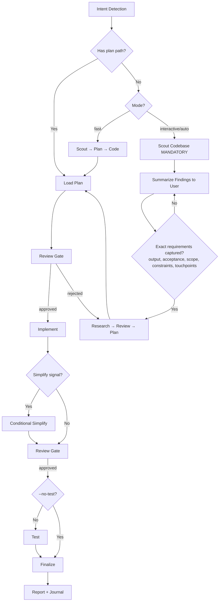

# Cook - Smart Feature Implementation

End-to-end implementation with automatic workflow detection.

**Principles:** YAGNI, KISS, DRY | Token efficiency | Concise reports

## Usage

```
/cook <natural language task OR plan path>
```

**IMPORTANT:** If no flag is provided, the skill will use the `interactive` mode by default for the workflow.

**Optional flags to select the workflow mode:** 
- `--interactive`: Full workflow with user input (**default**)
- `--fast`: Skip research, scout→plan→code
- `--parallel`: Multi-agent execution
- `--no-test`: Skip testing step
- `--auto`: Auto-approve low-risk steps; high-risk changes stop for human approval before finalize/commit/ship

**Composable flags** (combine with any mode):
- `--tdd`: Tests-first per phase — write tests for current behavior before
  refactoring, then verify they still pass after the implementation step

**Example:**
```
/cook "Add user authentication to the app" --fast
/cook path/to/plan.md --auto
/cook "Refactor auth middleware" --tdd
```

<HARD-GATE>
Do NOT write implementation code until a plan exists and has been reviewed.
This applies regardless of task simplicity. "Simple" tasks are where unexamined assumptions waste the most time.
Exception: `--fast` mode skips research but still requires a plan step.
User override: If user explicitly says "just code it" or "skip planning", respect their instruction.
</HARD-GATE>

<HARD-GATE-SCOUT-FIRST>
Before planning OR asking clarifying questions, scan the codebase. Mandatory scout outputs:
1. Project type, language(s), framework(s)
2. Existing modules/files relevant to the task
3. Current patterns/conventions for similar features (so the implementation matches them)
4. Existing docs in `./docs/` and any in-flight plans in `./plans/` covering this area
5. Public APIs, schemas, contracts that the task could affect

State a 3-6 bullet codebase-context summary to the user before asking questions. Skip ONLY when input is a `plan.md`/`phase-*.md` path (the plan already encodes scout output).
</HARD-GATE-SCOUT-FIRST>

<HARD-GATE-EXACT-REQUIREMENTS>
Before producing a plan, you MUST be able to answer ALL of these in one concrete sentence each (use `AskUserQuestion` to pin them down — do NOT proceed on vague intent):

1. **Expected output**: the concrete artifact(s) the user will see at the end (file paths, feature behavior, UI screen, API endpoint + payload, CLI command + flags).
2. **Acceptance criteria**: specific behaviors / inputs → outputs / edge cases that MUST work to call it "done".
3. **Scope boundary**: what is explicitly OUT of scope this round.
4. **Non-negotiable constraints**: stack, file locations, naming, backward compatibility, deadlines, performance.
5. **Touchpoints**: which existing files/modules (from scout) will be modified or extended; which contracts must stay stable.

Ground every `AskUserQuestion` option in scout findings (e.g., "Add to `src/api/users.ts` (matches existing pattern) or new `src/api/profile.ts`?"). Skip ONLY when input is a `plan.md`/`phase-*.md` path.
</HARD-GATE-EXACT-REQUIREMENTS>

<HARD-GATE-NO-SIDE-EFFECTS>
Implementation is NOT done until verified to be side-effect-free. Code-review and test gates MUST prove:

1. New behavior matches every acceptance criterion above.
2. All tests pass — including tests in modules that share files/contracts with the change.
3. No existing business logic / workflow regression: explicitly walk each touchpoint and any caller of changed functions.
4. No new lint/type/build errors anywhere in the repo.
5. Public contracts unchanged unless intentional and called out (function signatures, exported types, API responses, DB schemas, env vars, config keys).

User override: If user invoked `--no-test`, item 2 is downgraded to a warning. Surface the unverified-tests risk in the finalize `AskUserQuestion` so the user accepts the trade-off rather than having it silently chosen. Items 1, 3, 4, 5 remain enforceable via the mandatory `code-reviewer` subagent.

If review/testing reveals a side effect, regression, or broken workflow, STOP. Use `AskUserQuestion` to present:
- What broke (file, test, workflow, user-facing behavior)
- Why this implementation caused it (1-line cause)
- 2-4 concrete options for the user to choose, e.g.:
  - "Revert this slice and re-plan with stricter scope"
  - "Keep the implementation and update <dependents> to match the new contract"
  - "Add a compatibility shim at <boundary> so old callers keep working"
  - "Accept the regression — old behavior was unintended/buggy"

Let the user decide. Do not silently patch around regressions.
</HARD-GATE-NO-SIDE-EFFECTS>

## Anti-Rationalization

| Thought | Reality |
|---------|---------|
| "This is too simple to plan" | Simple tasks have hidden complexity. Plan takes 30 seconds. |
| "I already know how to do this" | Knowing ≠ planning. Write it down. |
| "Let me just start coding" | Undisciplined action wastes tokens. Plan first. |
| "The user wants speed" | Fastest path = plan → implement → done. Not: implement → debug → rewrite. |
| "I'll plan as I go" | That's not planning, that's hoping. |
| "Just this once" | Every skip is "just this once." No exceptions. |

## Smart Intent Detection

| Input Pattern | Detected Mode | Behavior |
|---------------|---------------|----------|
| Path to `plan.md` or `phase-*.md` | code | Execute existing plan |
| Contains "fast", "quick" | fast | Skip research, scout→plan→code |
| Contains "trust me", "auto" | auto | Auto-approve low-risk artifact-validated steps; stop on high-risk |
| Lists 3+ features OR "parallel" | parallel | Multi-agent execution |
| Contains "no test", "skip test" | no-test | Skip testing step |
| Default | interactive | Full workflow with user input |

See `references/intent-detection.md` for detection logic.

## Process Flow (Authoritative)



**This diagram is the authoritative workflow.** Prose sections below provide detail for each node. If prose conflicts with this flow, follow the diagram.

## Workflow Overview

```
[Intent Detection] → [Research?] → [Review] → [Plan] → [Review] → [Implement] → [Conditional Simplify?] → [Review] → [Test?] → [Review] → [Finalize]
```

**Default (non-auto):** Stops at `[Review]` gates for human approval before each major step.
**Auto mode (`--auto`):** Skips human review gates only for low-risk work. High-risk changes stop for human approval before finalize/commit/ship.
**Codex task plan items:** Utilize `update_plan`, `update_plan`, `update_plan`, `update_plan` during implementation step. **Fallback:** These are CLI-only tools — unavailable in VSCode extension. If they error, use `update_plan` checklist for progress tracking instead.

| Mode | Research | Testing | Review Gates | Phase Progression |
|------|----------|---------|--------------|-------------------|
| interactive | ✓ | ✓ | **User approval at each step** | One at a time |
| auto | ✓ | ✓ | Auto only if artifacts pass and high-risk stop is false | All low-risk phases continuously |
| fast | ✗ | ✓ | **User approval at each step** | One at a time |
| parallel | Optional | ✓ | **User approval at each step** | Parallel groups |
| no-test | ✓ | ✗ | **User approval at each step** | One at a time |
| code | ✗ | ✓ | **User approval at each step** | Per plan |

## Step Output Format

```
✓ Step [N]: [Brief status] - [Key metrics]
```

## Blocking Gates (Non-Auto Mode)

Human review required at these checkpoints (skipped with `--auto`):
- **Post-Research:** Review findings before planning
- **Post-Plan:** Approve plan before implementation
- **Post-Implementation:** Approve code before testing
- **Post-Testing:** 100% pass + approve before finalize

**Always enforced (all modes):**
- **Testing:** 100% pass required (unless no-test mode)
- **Code Review (MANDATORY):** Spawn `code-reviewer` subagent with explicit checks:
  (a) every acceptance criterion met,
  (b) no regression to business logic in touchpoints/blast-radius,
  (c) no breaking changes to public contracts (signatures, schemas, APIs, env vars) unless called out,
  (d) follows existing patterns from scout,
  (e) no new lint/type/build errors anywhere.
  Pass scout summary + acceptance criteria as context. If reviewer flags side effects → trigger HARD-GATE-NO-SIDE-EFFECTS (`AskUserQuestion` with 2-4 options).
  Then: User approval OR artifact-gated auto approval. Score is advisory; it never approves by itself.
- **Finalize (MANDATORY - never skip):**
  1. **Activate `/project-management` skill (MANDATORY)** → run full plan sync-back across ALL `phase-XX-*.md` (not only current phase), update `plan.md` status/progress, hydrate Codex task plan items, generate progress report
  2. `docs-manager` subagent → update `./docs` if changes warrant
  3. `update_plan` → mark all Codex task plan items complete after sync-back verification (skip if Codex subagent workflows unavailable)
  4. Ask user if they want to commit via `git-manager` subagent
  5. Run `/journal` to write a concise technical journal entry upon completion

## Required Subagents (MANDATORY)

| Phase | Subagent | Requirement |
|-------|----------|-------------|
| Research | `researcher` | Optional in fast/code |
| Scout | `scout` | Optional in code |
| Plan | `planner` | Optional in code |
| UI Work | `designer` | If frontend work |
| Testing | `tester`, `debugger` | **MUST** spawn |
| Review | `code-reviewer` | **MUST** spawn |
| Finalize | `/project-management` skill + `docs-manager`, `git-manager` subagents | **MUST** invoke all |

**CRITICAL ENFORCEMENT:**
- Steps 4, 5, 6 **MUST** use Codex subagent workflow to spawn subagents
- DO NOT implement testing, review, or finalization yourself - DELEGATE
- If workflow ends with 0 Codex subagent spawns, it is INCOMPLETE
- Pattern: `Task(subagent_type="[type]", prompt="[task]", description="[brief]")`

## References

- `references/intent-detection.md` - Detection rules and routing logic
- `references/workflow-steps.md` - Detailed step definitions for all modes
- `references/review-cycle.md` - Interactive and auto review processes
- `references/subagent-patterns.md` - Subagent invocation patterns
- `../_shared/references/workflow-artifacts.md` - Review artifact schema and validator contract

## Workflow Position

**Typically follows:** `/plan` (execute a plan), `/brainstorm` (implement agreed solution)
**Typically precedes:** `/code-review` (review after implementation), `/test` (validate changes)
**Related:** `/fix` (alternative for bug fixes), `/plan` (create plan before cooking)
