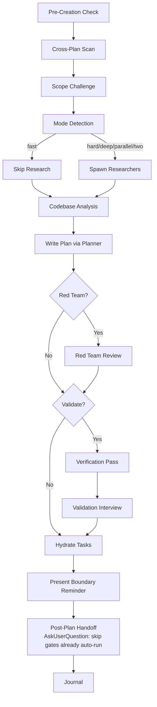

# Planning

Create detailed technical implementation plans through research, codebase analysis, solution design, and comprehensive documentation.

## Prerequisites

- **ClaudeKit CLI (v1.0.3+):** The `claudekit` CLI provides the `plan` subcommand for scaffolding, status updates, and inspection. Install with `npm install -g claudekit`. When available, prefer CLI for structural changes; fall back to direct file edits if CLI is absent.
  - **Detect availability by running `claudekit version` and checking the exit code** (0 = installed) — this works in any shell (bash, PowerShell, cmd). Do NOT use `claudekit --version` (`--version` is not a valid flag, always errors → falsely reports absent). Do NOT use `command -v claudekit` for cross-platform detection — it is bash-only and silently prints nothing in PowerShell (use `Get-Command claudekit` if you specifically need the path on Windows).

## Plan File Management

Use `claudekit plan` commands for scaffolding and status updates. Fill phase content directly with Write/Edit after scaffolding.

```bash
claudekit plan create --title "{title}" --phases "{P1},{P2}" --dir {plan-dir} --priority P1 --source skill
claudekit plan check <id> --dir "{plan-dir}"          # mark completed
claudekit plan check <id> --start --dir "{plan-dir}"  # mark in-progress
claudekit plan uncheck <id> --dir "{plan-dir}"        # revert to pending
claudekit plan add-phase "Name" --dir "{plan-dir}"    # add phase
claudekit plan status                                 # inspect progress of all plans in project (use -g for global)
claudekit config ui --port 3456                       # start plans dashboard → http://localhost:3456/plans
```

Rules:
- Scaffold plan structure via `claudekit plan create`; fill content sections with Write/Edit after.
- Default scope is project-local (`./plans/` under the current project).
- Global scope is conditional: fall back to global scope only when no project context exists (see Scope Selection).
- If `claudekit` is unavailable, create `plan.md` and `phase-*.md` directly and update the Status column in the Phases table by hand.
- The dashboard at `http://localhost:3456/plans` is an optional visual view — not required to manage plans.
- **Existing-file write guard:** When resuming or editing a plan that already has files, run a read pass over `plan.md` and **every** `phase-XX-*.md` before composing long replacement content. A directory listing is not enough. Codex enforces Read-before-Write on existing files; skipping any read causes that file's Write to be rejected after wasting the full Write payload. The files are tiny, so read them all first, then edit.

### Mandatory Existing-File Read Pass

When a plan dir already contains files (resuming an existing plan), before the first long Write/Edit to any plan file:

1. Enumerate existing files: `plan.md` plus all `phase-*.md`.
2. Read `plan.md`.
3. Read every existing `phase-*.md`, including phases you have not drafted yet.
4. Only after the read pass, write or edit the full content for `plan.md` and each phase.

Do not draft or submit a full phase body for an existing file that has not been read in the current session. Brand-new files you create fresh do not require a prior read.

### Canonical Phase File Template

Use this structure when filling each `phase-XX-*.md`. Loaded once with the skill — no per-file Read needed to learn it. Frontmatter fields match the phase schema; section headers match `documentation-management.md` so phase files stay consistent across plans.

````markdown
---
phase: <N>
title: "<Phase Name>"
status: pending       # pending | in-progress | completed
priority: P2          # P1 | P2 | P3
effort: ""            # e.g. "4h", "2d"
dependencies: []      # phase IDs this blocks on
---

# Phase <id>: <Name>

## Overview
<1-2 sentences describing what this phase delivers>

## Requirements
- Functional: ...
- Non-functional: ...

## Architecture
<Design, data flow, component interactions>

## Related Code Files
- Create: `path/...`
- Modify: `path/...`
- Delete: `path/...`

## Implementation Steps
1. ...
2. ...

## Success Criteria
- [ ] ...

## Risk Assessment
<Risks + mitigations>
````

**IMPORTANT:** Before you start, scan unfinished plans in the active scope first:
- Project scope: `./plans/`
- Global scope: the configured global plans root
  - Default when unset: `~/.claude/plans/`

If there are relevant plans overlapping your upcoming plan, update them as well. If you're unsure or need more clarifications, use `AskUserQuestion` tool to ask the user.

### Scope Selection

- **Project scope** is the default whenever the current working tree has project context.
- **Global scope** is allowed only when:
  - the user explicitly asks for it via `--global`, or
  - there is no project context to anchor a local plan.
- **No project context** means no `.git`, `package.json`, or `AGENTS.md` was found in the ancestor chain.
- Keep scope honest in prose and examples: the skill resolves scope itself based on the current project context.

### Cross-Plan Dependency Detection

During the pre-creation scan, detect and mark blocking relationships between plans:

1. **Scan** — Read `plan.md` frontmatter of each unfinished plan (status != `completed`/`cancelled`)
2. **Compare scope** — Check overlapping files, shared dependencies, same feature area
3. **Classify relationship:**
   - New plan needs output of existing plan → new plan `blockedBy: [existing-plan-dir]`
   - New plan changes something existing plan depends on → existing plan `blockedBy: [new-plan-dir]`, new plan `blocks: [existing-plan-dir]`
   - Cross-scope dependency → use `global:` or `project:` prefixes
   - Mutual dependency → both plans reference each other in `blockedBy`/`blocks`
4. **Bidirectional update** — When relationship detected, update BOTH `plan.md` files' frontmatter
5. **Ambiguous?** → Use `AskUserQuestion` with header "Plan Dependency", present detected overlap, ask user to confirm relationship type (blocks/blockedBy/none)

**Frontmatter fields**:
```yaml
blockedBy: [260301-1200-auth-system]            # Same-scope dependency
blockedBy: [global:260301-1200-auth-system]     # Cross-scope dependency
blocks: [project:260228-0900-user-dashboard]    # Explicit project-scope dependency
```

**Status interaction:** `plan.md` / `phase-*.md` frontmatter is the authoritative inspection surface. Same-scope bare refs stay in the current scope; prefixed refs resolve against the explicit project/global root. Missing refs should warn and show `not found`, not hard-fail the plan.

## Default (No Arguments)

If invoked with a task description, proceed with planning workflow. If invoked WITHOUT arguments or with unclear intent, use `AskUserQuestion` to present available operations:

| Operation | Description |
|-----------|-------------|
| `(default)` | Create implementation plan for a task |
| `archive` | Write journal entry & archive plans |
| `red-team` | Adversarial plan review |
| `validate` | Critical questions interview |

Present as options via `AskUserQuestion` with header "Planning Operation", question "What would you like to do?".

## Workflow Modes

Default: auto-detect planning mode (analyze task complexity and pick mode).

| Flag | Mode | Research | Red Team | Validation | Cook Flag |
|------|------|----------|----------|------------|-----------|
| `--auto` | Auto-detect | Follows mode | Follows mode | Follows mode | Follows mode |
| `--fast` | Fast | Skip | Skip | Skip | (none) |
| `--hard` | Hard | 2 researchers | Yes | Optional | (none) |
| `--deep` | Deep | 2-3 researchers + per-phase scout | Yes | Yes | (none) |
| `--parallel` | Parallel | 2 researchers | Yes | Optional | `--parallel` |
| `--two` | Two approaches | 2+ researchers | After selection | After selection | (none) |

**Composable flags** (combine with any mode):
| Flag | Effect |
|------|--------|
| `--tdd` | Add tests-first structure to each phase for regression-safe refactors |
| `--no-tasks` | Skip task hydration |
| `--preview` | Set `preview: true` in `plan.md` frontmatter → embed/refresh an inline mermaid business-flow diagram at the pre-cook gate (see `.codex/rules/business-flow-diagram.md`) |

When `--preview` is passed (directly to `/plan` or propagated from `brainstorm --preview`), add `preview: true` to the `plan.md` frontmatter right after scaffolding. The pre-cook gate (see "Post-Plan Handoff") reads this marker to (re)generate the diagram before offering `/cook`.

Load: `references/workflow-modes.md` for auto-detection logic, per-mode workflows, context reminders.

## When to Use

- Planning new feature implementations
- Architecting system designs
- Evaluating technical approaches
- Creating implementation roadmaps
- Breaking down complex requirements

## Core Responsibilities & Rules

Always honoring **YAGNI**, **KISS**, and **DRY** principles.
**Be honest, be brutal, straight to the point, and be concise.**

### 0. Scope Challenge
Load: `references/scope-challenge.md`
**Skip if:** `--fast` mode or trivial task (single file fix, <20 word description)

### 1. Research & Analysis
Load: `references/research-phase.md`
**Skip if:** Fast mode or provided with researcher reports

### 2. Codebase Understanding
Load: `references/codebase-understanding.md`
**Skip if:** Provided with scout reports

### 3. Solution Design
Load: `references/solution-design.md`

### 4. Plan Creation & Organization
Load: `references/plan-organization.md`

### 5. Task Breakdown & Output Standards
Load: `references/output-standards.md`

## Process Flow (Authoritative)



**This diagram is the authoritative workflow.** Prose sections below provide detail for each node.

## Workflow Process

1. **Pre-Creation Check** → Check Plan Context for active/suggested/none
1b. **Cross-Plan Scan** → Scan unfinished plans, detect `blockedBy`/`blocks` relationships, update both plans
1c. **Scope Challenge** → Run Step 0 scope questions, select mode (see `references/scope-challenge.md`)
    **Skip if:** `--fast` mode or trivial task
2. **Mode Detection** → Auto-detect or use explicit flag (see `workflow-modes.md`)
3. **Research Phase** → Spawn researchers (skip in fast mode)
4. **Codebase Analysis** → Read docs, scout if needed
5. **Plan Documentation** → Write comprehensive plan via planner subagent
6. **Red Team Review** → Run `/plan red-team {plan-path}` (hard/deep/parallel/two modes)
7. **Post-Plan Validation** → Run `/plan validate {plan-path}` (hard/deep/parallel/two modes)
8. **Hydrate Tasks** → Create Codex task plan items from phases (default on, `--no-tasks` to skip)
9. **Boundary Reminder** → Present optional next-step commands with absolute path
10. **Journal** → Run `/journal` to write a concise technical journal entry upon completion

### Whole-Plan Consistency Gate

This gate is mandatory after `/plan validate` or `/plan red-team` edits any plan file.
Load: `references/verification-roles.md` → "Whole-Plan Consistency Sweep".

Before recommending `/cook`, re-read `plan.md` and every `phase-*.md` file. Search all plan files for stale terms, rejected assumptions, renamed APIs/files/fields, superseded decisions, and duplicate embedded drafts/contracts. Reconcile contradictions across the entire plan, not only the edited phase.

If unresolved contradictions remain, report them and ask the user. Do not recommend cook until the whole-plan consistency sweep reports zero unresolved contradictions.

## Output Requirements
**IMPORTANT:** Invoke "/project-organization" skill to organize the outputs.

- DO NOT implement code - only create plans
- Respond with plan file path and summary
- Ensure self-contained plans with necessary context
- Include code snippets/pseudocode when clarifying
- **Business-flow diagram (`--preview` only):** per `.codex/rules/business-flow-diagram.md` — embed an inline mermaid flow in `plan.md` ONLY when invoked with the `--preview` flag; otherwise draw nothing.
- Fully respect the `./.codex/rules/development-rules.md` file

## Task Management

Plan files = persistent. Tasks = session-scoped. Hydration bridges the gap.

**Default:** Auto-hydrate tasks after plan files are written. Skip with `--no-tasks`.
**3-Task Rule:** <3 phases → skip task creation.
**Fallback:** Codex subagent workflows (`update_plan`/`update_plan`/`update_plan`/`update_plan`) are CLI-only — unavailable in VSCode extension. If they error, use `update_plan` checklist for tracking. Plan files remain the source of truth; hydration is an optimization, not a requirement.

Load: `references/task-management.md` for hydration pattern, update_plan patterns, cook handoff protocol.

### Hydration Workflow
1. Write plan.md + phase files (persistent layer)
2. update_plan per phase with `addBlockedBy` chain (skip if Codex subagent workflows unavailable)
3. update_plan for critical/high-risk steps within phases (skip if Codex subagent workflows unavailable)
4. Metadata: phase, priority, effort, planDir, phaseFile
5. Cook picks up via update_plan (same session) or re-hydrates (new session)

## Active Plan State

Check `## Plan Context` injected by hooks:
- **"Plan: {path}"** → Active plan. Ask "Continue? [Y/n]"
- **"Suggested: {path}"** → Branch hint only. Ask if activate or create new.
- **"Plan: none"** → Create new using `Plan dir:` from `## Naming`

After creating plan: `node .codex/scripts/set-active-plan.cjs {plan-dir}`
Reports: Active plans → plan-specific path. Suggested → default path.

### Important
**DO NOT** create plans or reports in arbitrary user directories.
**MUST** create plans or reports in one of these allowed roots:
- project scope → current working project directory
- global scope → configured global plans root
  - Default when unset: `~/.claude/plans/`

## Subcommands

| Subcommand | Reference | Purpose |
|------------|-----------|---------|
| `/plan archive` | `references/archive-workflow.md` | Archive plans + write journal entries |
| `/plan red-team` | `references/red-team-workflow.md` | Adversarial plan review with hostile reviewers |
| `/plan validate` | `references/validate-workflow.md` | Validate plan with critical questions interview |

## Post-Plan Handoff (MANDATORY at session end)

After `plan.md` + phase files are written and the user has reviewed/approved them, use `AskUserQuestion` to offer the appropriate next step. Recommend the option that best fits the plan's risk/scope; recommended option listed FIRST and labelled "(Recommended)".

**Pre-cook diagram refresh (MANDATORY before offering `/cook`):** if the preview intent is set (`preview: true` in `plan.md` frontmatter, originating from `brainstorm --preview` or `/plan --preview`), then BEFORE building the handoff that lists `/cook` as an option, (re)generate the inline mermaid business-flow diagram in `plan.md` from the CURRENT requirements — so any business-flow changes made by `/plan validate` or `/plan red-team` are reflected in the diagram cook will implement against. This is the single refresh point: every planning gate (validate/red-team) runs before cook, so refreshing here guarantees the diagram is fresh without re-rendering on every mutation. Rules: `.codex/rules/business-flow-diagram.md`.

| Option | Recommend When | Why |
|--------|----------------|-----|
| `/plan validate` | Plan is moderate-to-complex; user wants critical-questions interview before implementation | Cheapest gate — surfaces unspecified assumptions, missing acceptance criteria, hand-wavy phases |
| `/plan red-team` | Plan touches security, auth, payments, data integrity, public APIs, infra, or has high blast radius | Adversarial reviewers stress-test the plan for failure modes, attack vectors, and missing edge cases |
| `/cook <plan-path>` | Plan is small / well-understood / low-risk and user wants to start implementation | Skip extra gates; go straight to implementation |
| End session | User wants to review/share plan before deciding | Stop with plan path returned |

**Skip this step ONLY when:**
- The current invocation IS already a subcommand (`validate`, `red-team`, `archive`) — those have their own terminal handoff.
- User explicitly said "just plan, don't suggest next step".

**Skip an individual option ONLY when the active mode already auto-ran that gate (per Workflow Process Steps 6-7):**
- Omit `/plan red-team` from the offered options when mode is `--hard`, `--deep`, `--parallel`, or `--two` (Step 6 already ran adversarial review).
- Omit `/plan validate` from the offered options when mode is `--deep` (Step 7 already ran validation).
- If both gates already ran, the Post-Plan Handoff still fires but offers only `/cook <plan-path>` and `End session`.

After selection: invoke the chosen command with the plan path as argument for continuity.

## Quality Standards

- Thorough and specific, consider long-term maintainability
- Research thoroughly when uncertain
- Address security and performance concerns
- Detailed enough for junior developers
- Validate against existing codebase patterns

**Remember:** Plan quality determines implementation success. Be comprehensive and consider all solution aspects.

## Workflow Position

**Typically follows:** `/brainstorm` (after exploring options), `/scout` (after codebase discovery)
**May precede:** `/cook` after user approval (otherwise stop with plan path and next-step options)
**Related:** `/brainstorm` (explore before planning), `/cook` (execute after planning)
