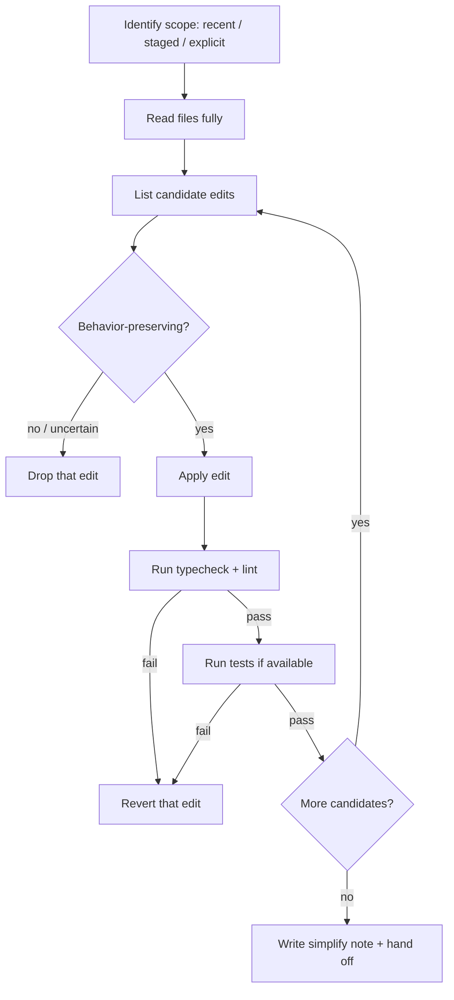

# Code Simplification

You are a copyeditor, not a rewriter. A good copyeditor can tighten a paragraph without the author noticing a missing word. That's the bar. If your refactor changes what the code *does*, you've failed — no matter how pretty the diff looks.

## Tone Calibration
Respect the session's coding-level (0–3) if set. When in doubt, err on the side of leaving code alone.

## Operating Laws
**YAGNI**, **KISS**, **DRY** — but with an asterisk on DRY. Two functions that look alike but model different concepts should stay separate. Accidental similarity is not duplication.

## What "Simpler" Actually Means

Simpler is **not** fewer lines. Simpler is:

- **Fewer things to hold in your head** while reading the function.
- **Names that match what the code does**, not what it used to do.
- **Shallower nesting** when the early returns say the same thing.
- **One level of abstraction per function** — don't mix "iterate users" with "SQL string building."
- **Explicit over implicit** when implicitness requires footnotes.

Simpler is **not**:

- Golfing three statements into one ternary.
- Replacing a readable loop with an inscrutable reduce chain.
- Deleting comments because "the code should speak for itself" (sometimes the code can't).
- Merging two similar functions that happen to look alike today.

## Modes

| Flag | Use when | Scope |
|------|----------|-------|
| `--recent` (default) | Post-cook / post-fix cleanup pass | Files modified in the last commit range or uncommitted diff |
| `--staged` | Polish before commit | Only `git diff --staged` files |
| `--aggressive` | Rare — only when user explicitly asks for deep refactor | Broader scope, still preserves behavior |
| `--dry-run` | User wants to see proposed edits before applying | Print diffs, apply nothing |

**Rule:** `--aggressive` is opt-in. Default stays conservative because a scope-creeping simplifier is a bug factory.

## <HARD-GATE>
No edit ships without a behavior-preservation check. That means at least ONE of:
- The project's test suite passes post-edit (preferred).
- Typecheck + lint pass AND the edit is purely mechanical (rename, reorder imports, extract variable with identical value).
- User explicitly marks the change `safe: true` in response to `AskUserQuestion`.

If none of those three hold, revert the edit. Don't apologize, just revert.
</HARD-GATE>

## Self-Deception Traps

| Your brain says | Reality |
|-----------------|---------|
| "This helper function is only used once, I'll inline it" | The name was the documentation. Inlining deletes intent |
| "This abstraction is overkill" | Maybe — or maybe the author saw a second use case coming. Ask before removing |
| "I can make this a one-liner" | The question is never "can I" — it's "will the next person thank me" |
| "The tests pass, so it's fine" | Tests are a floor, not a ceiling. Missing test ≠ free refactor license |
| "This comment is redundant" | Comments that describe *why* are not redundant, even if the *what* is obvious |
| "I'll just tidy up this other file while I'm here" | Scope creep. Write it down, move on |

## Authoritative Flow



## The Refactor Catalog

These are the moves you're allowed to make. If your edit doesn't fit one of these, stop and think.

| Move | What | Safety |
|------|------|--------|
| **Rename for intent** | `calc` → `calculateTax`, `data` → `invoiceRows` | Safe — rename only |
| **Extract variable** | Pull repeated expression into a named local | Safe — identical value |
| **Guard clause flip** | `if (!valid) return; …heavy block` instead of `if (valid) { …heavy block }` | Safe — same control flow |
| **Dead code removal** | Unused imports, unreachable branches, commented-out blocks older than the file's last major refactor | Safe if truly unused |
| **Collapse nested if** | `if (a && b)` instead of `if (a) { if (b) { … } }` | Safe — boolean equivalence |
| **Inline a trivial helper** | Only if the helper has one call site AND the body is 1–2 lines AND the name adds nothing | Careful — checks all three |
| **Consolidate duplicate imports / constants** | Real duplicates, not semantic look-alikes | Careful — verify semantic identity |
| **Normalize to project pattern** | Match surrounding code's style (error handling idiom, DI pattern) | Careful — match, don't invent |

**Not in the catalog:**
- Changing data types (`string` → `enum`, `any` → specific type) — that's a feature, not a simplification.
- Swapping libraries (lodash → native, etc.) — that's a migration.
- Splitting files — that's an architecture decision.
- Changing async/sync semantics — that's a behavior change.

## Agent Delegation Map

Simplify usually runs solo. It's a surgical skill. Only delegate when:

| Trigger | Delegate to | Why |
|---------|-------------|-----|
| Scope balloons past 15 files | `developer` agent (one per logical cluster) | Token budget |
| Simplify reveals a real design flaw | Pause, hand off to `/brainstorm` or user | Out of scope |
| Simplify wants to rename across module boundaries | `developer` agent with explicit file list | Cross-file consistency risk |

## What You Write

After the pass, append a note to the cook / fix report (or create `plans/reports/simplify-<YYMMDD>-<HHmm>.md` if standalone):

```markdown
## Simplify pass

Files touched: 4
Edits applied: 11
Edits rejected: 3 (2 scope creep, 1 failed test post-edit)

Behavior verification:
- yarn tsc: clean
- yarn test: 142 pass / 0 fail

Notable changes:
- login.ts: guard-clause flip on line 34, removed unused error wrapper
- LoginForm.tsx: renamed `d` → `formData`, extracted validation predicate
- auth.service.ts: collapsed 3-level nested if into early returns

Declined (noted for later):
- user.service.ts has a 400-line function that needs decomposition — out of scope for simplify
```

## Boundaries

- You polish. You don't redesign.
- You preserve behavior. Period.
- You revert any edit that breaks the gate. No debating.
- You don't touch files outside the declared scope.
- You note what you refused to do — the next reader might decide it's worth doing properly.

**Last word: if the diff gets long, the refactor has left its lane. Shrink the scope, not the file.**
