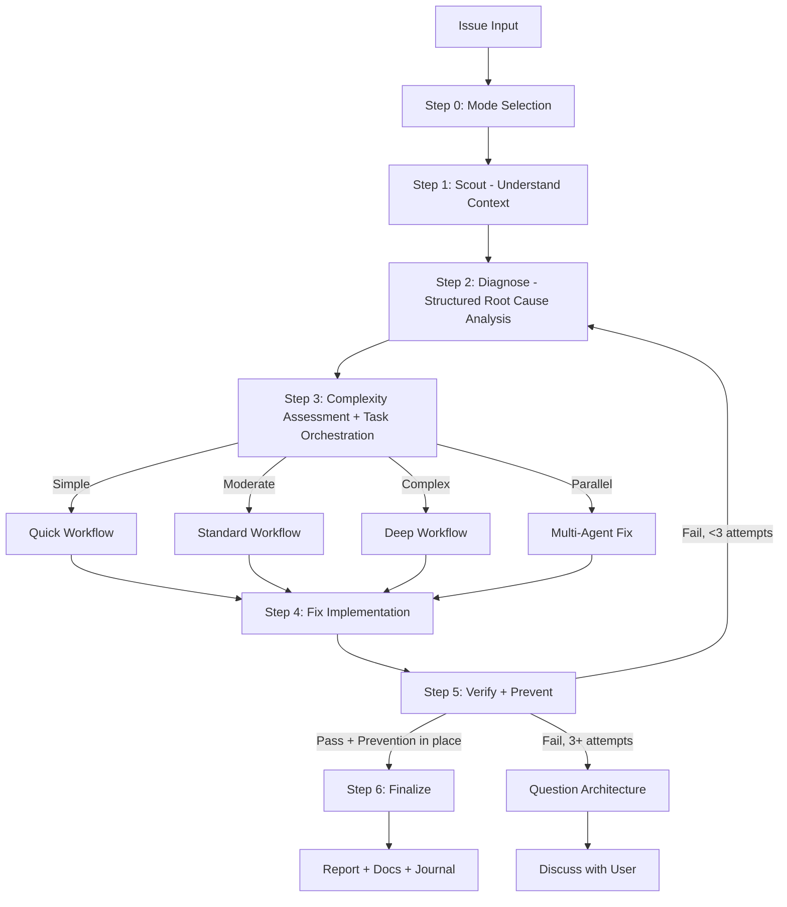

# Fixing

Unified skill for fixing issues of any complexity with intelligent routing.

## Arguments

- `--auto` - Activate autonomous mode (**default**); high-risk fixes stop for human approval before finalize/commit/ship
- `--review` - Activate human-in-the-loop review mode
- `--quick` - Activate quick mode
- `--parallel` - Activate parallel mode: route to parallel `developer` agents per issue

<HARD-GATE>
Do NOT propose or implement fixes before completing Steps 1-2 (Scout + Diagnose).
Symptom fixes are failure. Find the cause first through structured analysis, NEVER guessing.
If 3+ fix attempts fail, STOP and question the architecture — discuss with user before attempting more.
User override: `--quick` mode allows fast scout→diagnose→fix cycle for trivial issues (lint, type errors).
</HARD-GATE>

<HARD-GATE-SCOUT-FIRST>
Always scan the codebase BEFORE asking clarifying questions or forming hypotheses. Mandatory scout outputs (collect before Step 2):
1. Project type, language(s), framework(s) — from package.json/pyproject.toml/go.mod/etc.
2. The exact file(s) where the symptom surfaces + their direct callers/dependents
3. Related tests covering the affected area
4. Recent commits (`git log --oneline -20`) touching scouted files — possible introducer
5. Existing patterns/conventions for this kind of code (so the fix matches them)

State a 3-6 bullet codebase-context summary to the user before asking questions.
</HARD-GATE-SCOUT-FIRST>

<HARD-GATE-EXACT-ROOT-CAUSE>
Do NOT propose a fix until you can answer ALL of these in one concrete sentence each:

1. **Exact symptom**: precise error message / failing assertion / observed behavior (copy verbatim, not paraphrased).
2. **Reproduction steps**: minimal sequence that triggers it (commands, inputs, environment).
3. **Expected vs actual**: what SHOULD happen vs what DOES happen.
4. **Root cause** (not symptom): the underlying defect — a specific line, missing check, race condition, contract violation, or design flaw. Cite file:line evidence.
5. **Why now**: what change/condition exposed it (recent commit, data shape, env, dep upgrade).
6. **Blast radius**: every code path that depends on the broken behavior or shares the same root cause.

If ANY item is vague ("probably", "I think", "something with…"), use `AskUserQuestion` to gather missing facts (logs, repro, env) OR run more scout/debug — never guess.

Use `AskUserQuestion` with options grounded in scout findings (specific files, specific commits, specific functions) — never abstract.
</HARD-GATE-EXACT-ROOT-CAUSE>

<HARD-GATE-NO-SIDE-EFFECTS>
The fix is NOT done until verified to be side-effect-free. Step 5 MUST prove:

1. Original symptom no longer reproduces (re-run exact pre-fix repro from Step 2).
2. All tests in modified files + transitively-affected modules pass.
3. No business logic / workflow regression in the **blast radius** identified above (run those tests too, or manually walk the affected flows).
4. No new lint/type/build errors introduced anywhere.
5. Public API contracts (function signatures, exported types, response shapes, DB schemas, env vars) unchanged — OR change is intentional and called out.

If verification reveals a side effect, regression, or broken workflow, STOP. Do NOT silently patch around it. Use `AskUserQuestion` to present:
- What broke (file, test, workflow)
- Why the fix caused it (1-line cause)
- 2-4 concrete options to choose from, e.g.:
  - "Revert the fix and try a different root-cause angle"
  - "Keep the fix and update the dependent code at <files> to match the new contract"
  - "Narrow the fix scope to <subset> so the regression goes away"
  - "Accept the regression — it was buggy behavior the test was locking in"

Let the user decide. Do not assume.
</HARD-GATE-NO-SIDE-EFFECTS>

## Anti-Rationalization

| Thought | Reality |
|---------|---------|
| "I can see the problem, let me fix it" | Seeing symptoms ≠ understanding root cause. Scout first. |
| "Quick fix for now, investigate later" | "Later" never comes. Fix properly now. |
| "Just try changing X" | Random fixes waste time and create new bugs. Diagnose first. |
| "It's probably X" | "Probably" = guessing. Use structured diagnosis. Verify first. |
| "One more fix attempt" (after 2+) | 3+ failures = wrong approach. Question architecture. |
| "Emergency, no time for process" | Systematic diagnosis is FASTER than guess-and-check. |
| "I already know the codebase" | Knowledge decays. Scout to verify assumptions before acting. |
| "The fix is done, tests pass" | Without prevention, same bug class will recur. Add guards. |

## Process Flow (Authoritative)



**This diagram is the authoritative workflow.** If prose conflicts with this flow, follow the diagram.

## Workflow

### Step 0: Mode Selection

**First action:** If there is no "auto" keyword in the request, use `AskUserQuestion` to determine workflow mode:

| Option | Recommend When | Behavior |
|--------|----------------|----------|
| **Autonomous** (default) | Simple/moderate issues | Auto-approve only when review artifacts and validator pass |
| **Human-in-the-loop Review** | Critical/production code | Pause for approval at each step |
| **Quick** | Type errors, lint, trivial bugs | Fast scout → diagnose → fix → review cycle |

See `references/mode-selection.md` for AskUserQuestion format.

### Step 1: Scout (MANDATORY — never skip)

**Purpose:** Understand the affected codebase BEFORE forming any hypotheses.

**Mandatory skill chain:**
1. Activate `scout` skill OR launch 2-3 parallel `Explore` subagents
2. Discover: affected files, dependencies, related tests, recent changes (`git log`)
3. Read `./docs` for project context if unfamiliar

**Quick mode:** Minimal scout — locate affected file(s) and their direct dependencies only.
**Standard/Deep mode:** Full scout — map module boundaries, test coverage, call chains.

**Output:** `✓ Step 1: Scouted - [N] files mapped, [M] dependencies, [K] tests found`

### Step 2: Diagnose (MANDATORY — never skip)

**Purpose:** Structured root cause analysis. NO guessing. Evidence-based only.

**Mandatory skill chain:**
1. **Capture pre-fix state:** Record exact error messages, failing test output, stack traces, log snippets. This becomes the baseline for Step 5 verification.
2. Activate `debug` skill (systematic-debugging + root-cause-tracing techniques).
3. Activate `sequential-thinking` skill — form hypotheses through structured reasoning, NOT guessing.
4. Spawn parallel `Explore` subagents to test each hypothesis against codebase evidence.
5. If 2+ hypotheses fail → auto-activate `problem-solving` skill for alternative approaches.
6. Create diagnosis report: confirmed root cause, evidence chain, affected scope.

See `references/diagnosis-protocol.md` for full methodology.

**Output:** `✓ Step 2: Diagnosed - Root cause: [summary], Evidence: [brief], Scope: [N files]`

### Step 3: Complexity Assessment & Task Orchestration

Classify before routing. See `references/complexity-assessment.md`.

| Level | Indicators | Workflow |
|-------|------------|----------|
| **Simple** | Single file, clear error, type/lint | `references/workflow-quick.md` |
| **Moderate** | Multi-file, root cause unclear | `references/workflow-standard.md` |
| **Complex** | System-wide, architecture impact | `references/workflow-deep.md` |
| **Parallel** | 2+ independent issues OR `--parallel` flag | Parallel `developer` agents |

**Task Orchestration (Moderate+ only):** After classifying, create native Claude Tasks for all phases upfront with dependencies. See `references/task-orchestration.md`.
- Skip for Quick workflow (< 3 steps, overhead exceeds benefit)
- Use `TaskCreate` with `addBlockedBy` for dependency chains
- Update via `TaskUpdate` as each phase completes
- For Parallel: create separate task trees per independent issue
- **Fallback:** Task tools (`TaskCreate`/`TaskUpdate`/`TaskGet`/`TaskList`) are CLI-only — unavailable in VSCode extension. If they error, use `TodoWrite` for progress tracking. Fix workflow remains fully functional without them.

### Step 4: Fix Implementation

- Implement fix per selected workflow, updating Tasks as phases complete.
- Follow diagnosis findings — fix the ROOT CAUSE, not symptoms.
- Minimal changes only. Follow existing patterns.

### Step 5: Verify + Prevent (MANDATORY — never skip)

**Purpose:** Prove the fix works, has NO side effects, and prevents the same bug class from recurring. See HARD-GATE-NO-SIDE-EFFECTS.

**Mandatory skill chain:**
1. **Verify (iron-law):** Run the EXACT commands from pre-fix state capture. Compare output. NO claims without fresh evidence.
2. **Regression test:** Add or update test(s) that specifically cover the fixed issue. The test MUST fail without the fix and pass with it.
3. **Side-effect sweep (NEW):** Run tests across the full **blast radius** identified in Step 2 (not just the modified file). Walk each dependent code path. Confirm public contracts unchanged (signatures, response shapes, DB schemas, env vars).
4. **Code review (delegate):** Spawn `code-reviewer` subagent with explicit instructions to check: (a) root cause actually addressed (not symptom-patched), (b) no broken business logic in blast radius, (c) no new failure modes, (d) follows existing patterns from scout. Pass scout summary + diagnosis report as context.
5. **Artifact gate:** Write review artifacts from `../_shared/references/workflow-artifacts.md`, then run `node claude/hooks/workflow-artifact-gate.cjs --stage finalize --artifact-dir <artifact-dir>`.
6. **Prevention gate:** Apply defense-in-depth validation where applicable. See `references/prevention-gate.md`.
7. **Parallel verification:** Launch `Bash` agents for typecheck + lint + build + test.

**If verification fails OR a side effect is detected:** Use `AskUserQuestion` per HARD-GATE-NO-SIDE-EFFECTS — present what broke, why, and 2-4 concrete options (revert, narrow scope, update dependents, accept). Never silently patch.

**If verification fails:** Loop back to Step 2 (re-diagnose). After 3 failures → question architecture, discuss with user.

See `references/prevention-gate.md` for prevention requirements.

**Output:** `✓ Step 5: Verified + Prevented - [before/after comparison], [N] tests added, [M] guards added`

### Step 6: Finalize (MANDATORY — never skip)

1. Report summary: confidence score, root cause, changes, files, prevention measures, side-effect sweep results
2. **Activate `/project-management` skill (MANDATORY)** → sync plan/task status (if fix is part of a plan), update progress, hydrate Claude Tasks, generate status report
3. `docs-manager` subagent → update `./docs` if changes warrant (NON-OPTIONAL)
4. `TaskUpdate` → mark ALL Claude Tasks `completed` (skip if Task tools unavailable)
5. Ask user if they want to commit via `git-manager` subagent
6. Run `/journal` to write a concise technical journal entry upon completion

---

## IMPORTANT: Skill/Subagent Activation Matrix

See `references/skill-activation-matrix.md` for complete matrix.

**Always activate (ALL workflows):**
- `scout` (Step 1) — understand before diagnosing
- `debug` (Step 2) — systematic root cause investigation
- `sequential-thinking` (Step 2) — structured hypothesis formation

**Always activate (Step 6 Finalize):**
- `project-management` — MANDATORY for sync-back and progress tracking, every fix

**Conditional:**
- `problem-solving` — auto-triggers when 2+ hypotheses fail in Step 2
- `brainstorm` — multiple valid approaches, architecture decision (Deep only)

**Subagents:** `debugger`, `researcher`, `planner`, `code-reviewer`, `tester`, `Bash`
**Parallel:** Multiple `Explore` agents for scouting, `Bash` agents for verification

## Output Format

Unified step markers:
```
✓ Step 0: [Mode] selected
✓ Step 1: Scouted - [N] files, [M] deps
✓ Step 2: Diagnosed - Root cause: [summary]
✓ Step 3: [Complexity] detected - [workflow] selected
✓ Step 4: Fixed - [N] files changed
✓ Step 5: Verified + Prevented - [tests added], [guards added]
✓ Step 6: Complete - [action taken]
```

## References

Load as needed:
- `references/mode-selection.md` - AskUserQuestion format for mode
- `references/diagnosis-protocol.md` - Structured diagnosis methodology (NEW)
- `references/prevention-gate.md` - Prevention requirements after fix (NEW)
- `references/complexity-assessment.md` - Classification criteria
- `references/task-orchestration.md` - Native Claude Task patterns for moderate+ workflows
- `references/workflow-quick.md` - Quick: scout → diagnose → fix → verify+prevent → review
- `references/workflow-standard.md` - Standard: full pipeline with Tasks
- `references/workflow-deep.md` - Deep: research + brainstorm + plan with Tasks
- `../_shared/references/workflow-artifacts.md` - Review artifact schema and validator contract
- `references/review-cycle.md` - Review logic (autonomous vs HITL)
- `references/skill-activation-matrix.md` - When to activate each skill
- `references/parallel-exploration.md` - Parallel Explore/Bash/Task coordination patterns

**Specialized Workflows:**
- `references/workflow-ci.md` - GitHub Actions/CI failures
- `references/workflow-logs.md` - Application log analysis
- `references/workflow-test.md` - Test suite failures
- `references/workflow-types.md` - TypeScript type errors
- `references/workflow-ui.md` - Visual/UI issues (requires design skills)

## Workflow Position

**Typically follows:** `/debug` (after root cause analysis), `/scout` (after locating affected code)
**Typically precedes:** `/code-review` (review the fix), `/test` (validate the fix)
**Related:** `/cook` (alternative for feature work), `/debug` (diagnose before fixing)
